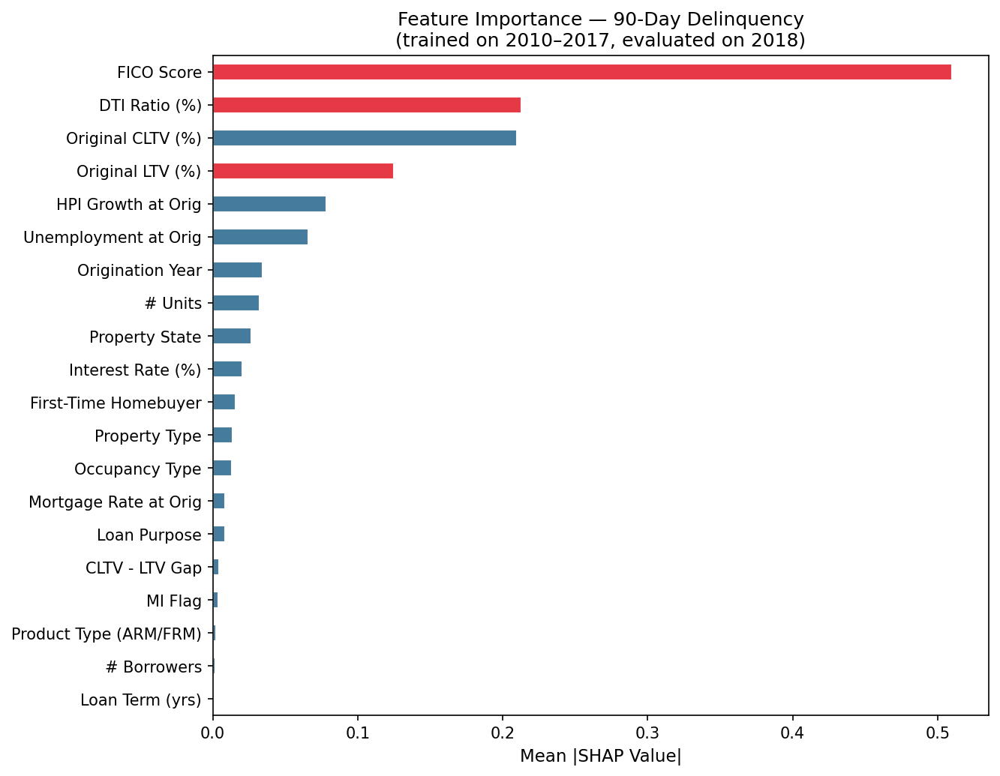
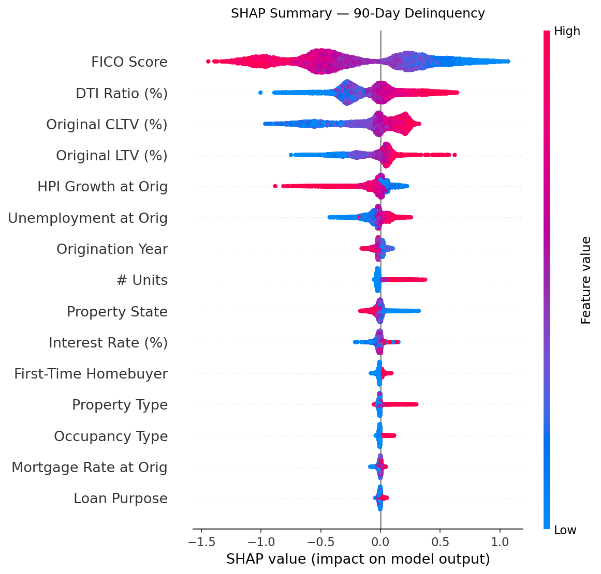
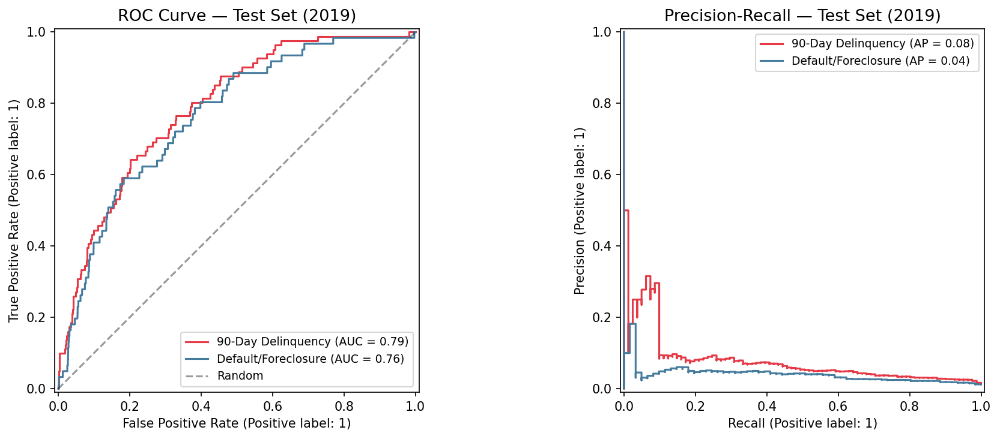
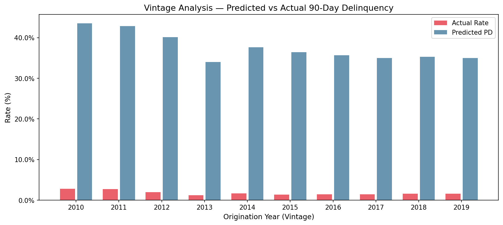

# Single-Family Loan Default Risk Model

Predicting 90-day delinquency and mortgage default from origination-time features using publicly available single-family loan performance data.

[](https://python.org)
[]()
[]()

---

## What This Does

Four-phase pipeline that goes from raw loan data to plain-English risk narratives:

```
Origination features
    → XGBoost model  (AUC 0.791, KS 0.440)
    → Platt scaling  (calibrated probabilities)
    → SHAP values    (per-loan attribution)
    → Claude API     (plain-English narrative)
    → Streamlit      (interactive dashboard)
```

---

## Results

| Model | Test AUC | Test KS | Event Rate |
|-------|----------|---------|------------|
| 90-Day Delinquency (24mo) | 0.791 | 0.440 | 1.6% |
| Default / Foreclosure | 0.765 | 0.407 | 1.2% |

Trained on 40,000 loans (2010–2017), validated on 5,000 (2018), tested on 5,000 (2019).

### SHAP Feature Importance — 90-Day Delinquency



### SHAP Beeswarm — Direction & Magnitude



### ROC & Precision-Recall Curves



### Vintage Analysis — Predicted PD vs Actual Rate



---

## Key Design Decisions

**Time-based validation only** — no random k-fold. Mortgage data is time-series-like. Training on 2021 loans to predict 2015 loans inflates AUC artificially. Split: Train 2010–2017 | Validate 2018 | Test 2019.

**Two targets** — `ever_90dpd_24mo` (early delinquency signal) and `ever_default` (foreclosure/loss event). Comparing them shows which features predict payment stress vs terminal default.

**No data leakage** — all features are origination-time only. No performance-period information in the feature set.

**Calibrated probabilities** — raw XGBoost scores are not probabilities. Platt scaling fitted on the 2018 validation set converts them to calibrated PDs before any narrative generation.

**Explainability, not decisioning** — SHAP values and LLM narratives describe what historical patterns suggest. No credit decisions, approvals, denials, or pricing recommendations are generated.

---

## Project Structure

```
loan-default-risk/
├── data/
│   ├── raw/                    # Raw loan files (not committed)
│   └── processed/              # Parquet splits (generated)
├── src/
│   ├── synthetic_data.py       # Synthetic data generator (dev/CI)
│   ├── preprocessing.py        # Feature engineering + time splits
│   ├── model.py                # XGBoost training + SHAP + vintage analysis
│   ├── dashboard.py            # Streamlit dashboard (5 tabs)
│   └── llm_explain.py          # Claude API narrative generator
├── results/                    # Plots and importance CSVs
├── requirements.txt
└── README.md
```

---

## Quickstart

### 1. Install
```bash
git clone https://github.com/surya-p-kalidindi/loan-default-risk
cd loan-default-risk
pip install -r requirements.txt
# Mac: conda install -c conda-forge xgboost
```

### 2. Generate synthetic data
```bash
python3 src/synthetic_data.py
```

### 3. Preprocess
```bash
python3 src/preprocessing.py
```

### 4. Train
```bash
python3 src/model.py
```

### 5. Dashboard
```bash
streamlit run src/dashboard.py
```

### 6. LLM Narratives
```bash
export ANTHROPIC_API_KEY=sk-ant-your-key
python3 src/llm_explain.py --target ever_90dpd_24mo
```

---

## Feature Set (20 features, origination-time only)

| Feature | Description |
|---------|-------------|
| FICO Score | Borrower credit score (min of borrower/co-borrower) |
| DTI Ratio | Debt-to-income ratio at origination |
| Original LTV | Loan-to-value ratio |
| Original CLTV | Combined LTV (captures second liens) |
| CLTV-LTV Gap | Presence and size of second lien |
| First-Time Homebuyer | Binary flag |
| Loan Purpose | Purchase / rate-term refi / cash-out refi |
| Occupancy Type | Primary / second home / investor |
| Property Type | SFR / condo / PUD / manufactured |
| Number of Units | 1–4 unit properties |
| Mortgage Insurance | MI flag |
| Interest Rate | Note rate at origination |
| Loan Term | 15 / 20 / 30 year |
| Origination Year | Vintage proxy |
| Mortgage Rate at Orig | 30yr avg rate |
| Unemployment at Orig | State unemployment rate |
| HPI Growth at Orig | Home price appreciation |

---

## LLM Narrative Example

Input: FICO 620, DTI 48%, LTV/CLTV 97%, First-Time Buyer, Purchase

> "This loan falls within the HIGH-risk segment based on historical loan performance patterns observed in similar loans. The elevated risk profile is primarily attributable to the borrower's FICO score of 620, which accounts for over 40% of the model's risk attribution, combined with a debt-to-income ratio of 48% that constrains financial flexibility. The 97% loan-to-value ratio provides minimal equity cushion at origination. Some offset is provided by the relatively low unemployment rate of 3.9% at origination, indicating favorable macroeconomic conditions at the time of loan inception."

---

## Disclaimer

This project is for research and educational purposes only. Models and narratives generated here do not represent any institution's actual risk models, data, or credit policies. No credit decisions should be made based on this tool.

---

## References

1. Lundberg & Lee (2017). SHAP. NeurIPS.
2. Platt (1999). Probabilistic outputs for SVMs.

## License
MIT

## Author
Surya Prithvi Raju Kalidindi
